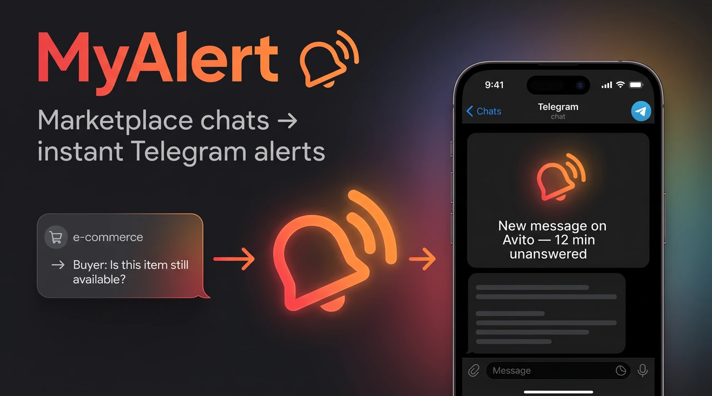
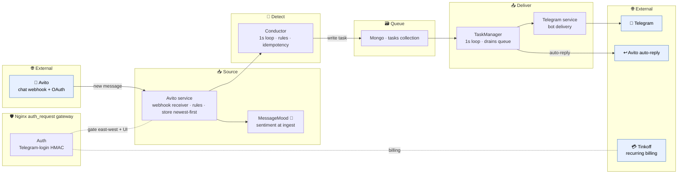
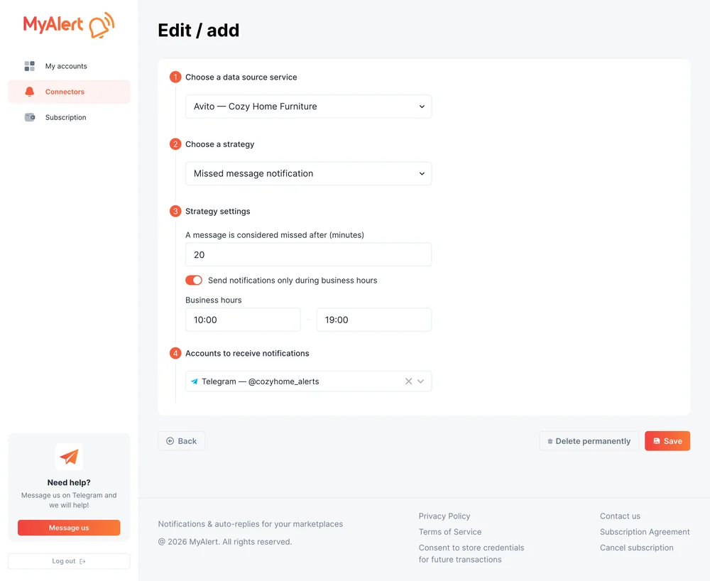
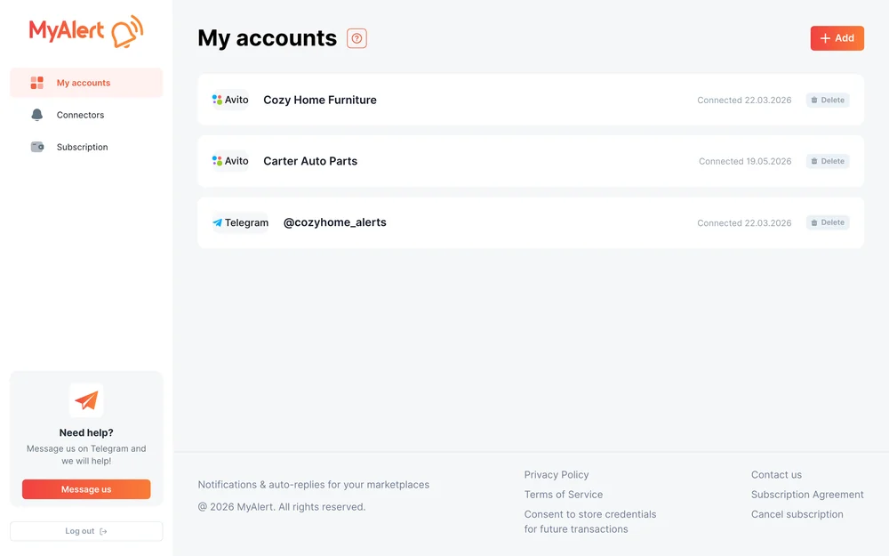
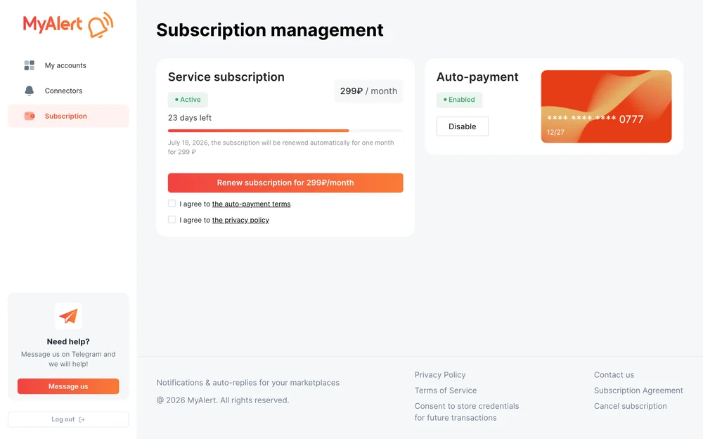
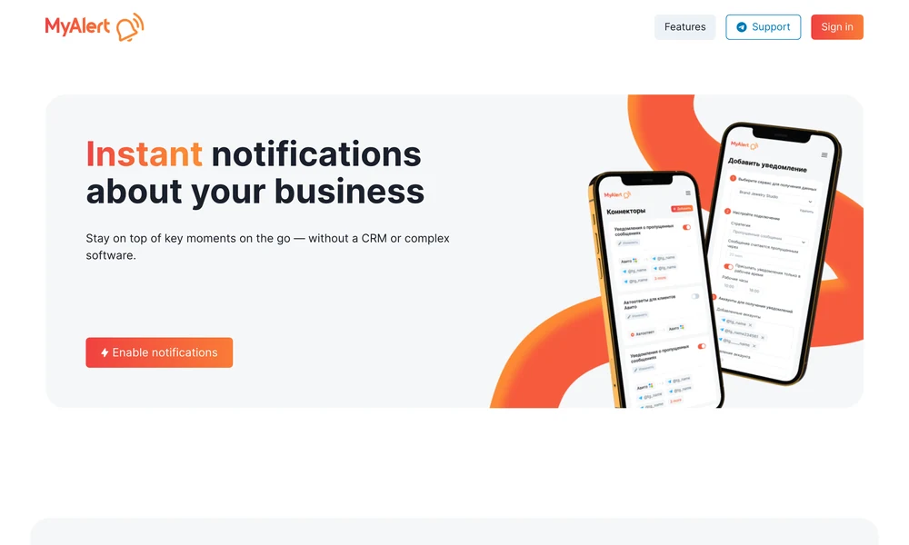

<div align="center">

# 📣 MyAlert

**Marketplace chats → instant Telegram alerts.**
Sellers get a Telegram ping the moment an Avito chat needs attention (a missed message, a first contact, or a negative-sentiment message) and can fire an auto-reply back. A real-time event pipeline built as a multi-container Docker microservice mesh.


[Architecture](#-architecture) · [How it works](#-how-it-works) · [Highlights](#-engineering-highlights) · [Screenshots](#-screenshots) · [Build & run](#-build--run) · [Status & scope](#-status--scope)

<br/>


</div>

---

## What it is

**MyAlert** is a notification SaaS for marketplace sellers. When a buyer writes to a seller on **Avito** and the chat needs attention, MyAlert delivers a **Telegram** alert in seconds, and can post an automatic reply back into the Avito chat to buy the seller time.

It watches three things on every conversation:

- 📭 **Missed message:** a buyer wrote and no human has answered.
- 👋 **First contact:** a brand-new conversation just started.
- 😠 **Negative sentiment:** the buyer's message reads as angry or unhappy (scored by a Python NLP service at ingest).

All detection is gated by the seller's **business hours**, deduplicated by **idempotency marks**, and delivered through a small mesh of single-purpose services. A React dashboard handles Telegram login, connecting an Avito account, choosing which events to watch, and a Tinkoff subscription.

> **Honest scope:** only the **Avito → Telegram** path is wired today. Other sources (Amazon, etc.) and other messengers are on the roadmap, not in this codebase. See [Status & scope](#-status--scope).

## 🏗 Architecture

The system is a chain of independent services: a **source** ingests events, a **detector** decides what is alert-worthy, a **queue** decouples detection from delivery, and a **deliverer** fans out to channels. Everything sits behind an Nginx `auth_request` gateway.



External systems (Avito, Telegram, Tinkoff) are shaded in blue; everything else is an in-mesh service. Full component breakdown in [`docs/architecture.md`](docs/architecture.md).

## ⚙️ How it works

1. **Ingest by webhook.** On connect, the Avito service registers a **webhook** for the seller's account, so new buyer messages arrive in real time (the only cron job is a 5-minute OAuth token refresh, no polling for messages). Each message is stored **newest-first** and **scored for sentiment at ingest** by the Python `MessageMood` service (dostoevsky + a Russian fastText model).
2. **Detect with the Conductor.** A 1-second orchestration loop walks fresh conversations and applies the rules (**lost-message**, **first-message**, **negative-mood**), each gated by the seller's **business hours** and guarded by per-event **idempotency marks** so the same situation never alerts twice.
3. **Queue a task.** When a rule fires, the Conductor writes a **task** into a Mongo `tasks` collection. There is no message broker: the collection *is* the queue, which keeps detection and delivery fully decoupled.
4. **Deliver.** A second 1-second loop, the **TaskManager**, drains the queue and delivers: a **Telegram** alert to the seller and/or an **Avito auto-reply** into the chat.

## ✨ Engineering highlights

- 🔔 **Webhook ingest, not polling:** messages arrive push-style; the only scheduled job is a 5-minute OAuth token refresh.
- 🐍 **Sentiment at ingest:** every message is scored once, at write time, by a dedicated Python NLP service (dostoevsky + Russian fastText), so the detector reads a precomputed mood instead of calling a model in the hot path.
- 🪪 **Idempotent detection:** each rule writes an idempotency mark, so a missed message or a first-contact alert is emitted exactly once, even though the Conductor loop re-scans every second.
- ✉️ **The invisible-character trick:** an auto-reply carries the zero-width Hangul Filler `ㅤ` (U+3164). When the Avito service later sees a reply containing that character, it knows the reply was sent by the bot, so a robot answer doesn't count as a *human* answer and won't wrongly suppress the "missed message" alert.
- 🛡️ **`auth_request` gateway:** Nginx authenticates every inbound request against the Auth service (Telegram-login HMAC) before it reaches any backend service, centralising authn at the edge.
- 💳 **Tinkoff recurring billing:** a dedicated Payment service drives a recurring subscription (trial → monthly) via Tinkoff.

## 📸 Screenshots

<table>
<tr>
<td width="50%"><br/><sub>The connector builder: source → strategy → output (Avito → missed-message → Telegram)</sub></td>
<td width="50%"><br/><sub>Connected accounts: Avito sources + Telegram delivery</sub></td>
</tr>
<tr>
<td width="50%"><br/><sub>Subscription &amp; recurring payment (Tinkoff)</sub></td>
<td width="50%"><br/><sub>Landing: the product pitch</sub></td>
</tr>
</table>

<sub>Rendered from the real React app with sample data via a mock backend.</sub>

---

## 📁 Repository structure

```text
myalert-case/
├── backend/    Node/Express microservice mesh + Python sentiment service (the core)
├── frontend/   React/Vite dashboard: Telegram login, connect Avito, pick events, subscribe
├── deploy/     Ansible push-deploy slice (sanitized hosts)
└── docs/       Architecture, pipeline, trade-offs, deploy notes
```

Each component carries its own README and `.env.example`.

## 🚀 Build & run

<details>
<summary><b>Backend: microservice mesh (the core)</b></summary>

```bash
cd backend
cp .env.example .env          # per-service hosts, Mongo creds, Avito OAuth, Telegram bot, Tinkoff keys
# MessageMood needs the Russian fastText weights (gitignored, large);
# download them separately as documented in backend/README.md
docker compose up --build     # Nginx gateway + 11 app services (plus a dozzle log viewer) + MongoDB
```
See [`backend/README.md`](backend/README.md) and [`docs/architecture.md`](docs/architecture.md).
</details>

<details>
<summary><b>Frontend: React dashboard</b></summary>

```bash
cd frontend
cp .env.example .env          # VITE_API_URL, Telegram bot id, Avito client id
npm install
npm run dev
```
See [`frontend/README.md`](frontend/README.md).
</details>

<details>
<summary><b>Deploy: Ansible push</b></summary>

```bash
cd deploy
cp inventory.example.ini inventory.ini   # your hosts + a least-priv deploy user
ansible-playbook -i inventory.ini deploy-backend-alert.yml
ansible-playbook -i inventory.ini deploy-frontend-alert.yml
```
See [`docs/deploy.md`](docs/deploy.md).
</details>

## 🔎 Status & scope

This repo is a **faithful snapshot** of a working product, cleaned and translated to English for a public showcase, not a re-architecture.

- ✅ **Live today:** the **Avito → Telegram** path end to end (webhook ingest, sentiment, three rules, queue, Telegram + Avito auto-reply), Telegram-login auth, and Tinkoff billing.
- 🗺️ **Roadmap (not in this codebase):** additional sources (Amazon, etc.) and additional messengers. The product is *designed* to be multi-source, but only one source and one channel are wired.
- ⏱️ **Known temporary solution:** the Conductor and TaskManager run **1-second busy-loops** over Mongo instead of consuming a broker or change stream. It works and is honest about its limits. The candid "what I'd evolve next" write-up lives in [`docs/trade-offs.md`](docs/trade-offs.md).

## 📚 Documentation

- [`docs/architecture.md`](docs/architecture.md): services, the gateway, the four Mongo DBs, east-west HTTP.
- [`docs/pipeline.md`](docs/pipeline.md): the source → detect → queue → deliver pipeline in depth.
- [`docs/trade-offs.md`](docs/trade-offs.md): what I'd evolve next, and why it is the way it is.
- [`docs/deploy.md`](docs/deploy.md): the Ansible push-deploy model.

## 📄 License

Released under the [MIT License](LICENSE).

## 👤 Author

**Alex Polezhaev**, full-stack engineer.
I build end-to-end products across backends, web, automation, and integrations. **Relocating to the United States, open to roles.**

- GitHub: [@alex-polezhaev](https://github.com/alex-polezhaev)
- Email: polezhaev.advert@gmail.com
