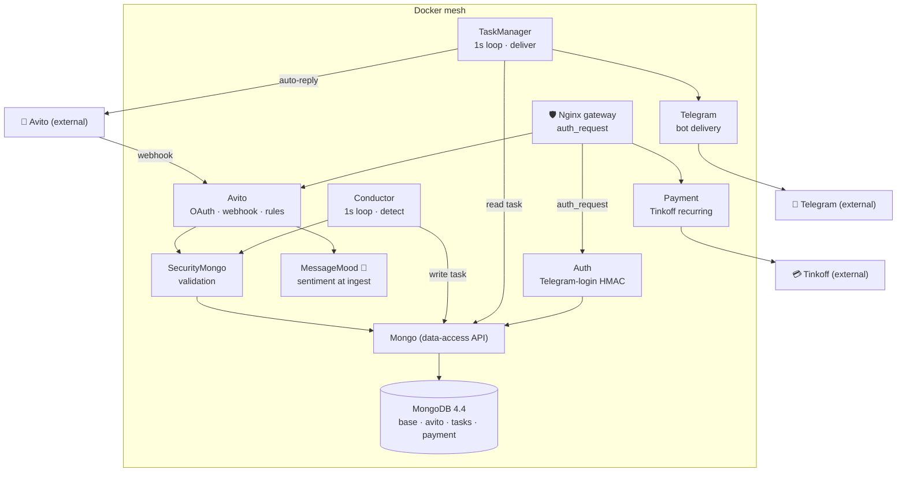

# Architecture

MyAlert is an **multi-container Docker microservice mesh** behind an **Nginx `auth_request` gateway**. Each service does one job; they talk **east-west over HTTP**; there is no message broker: a Mongo `tasks` collection is the queue. The data plane is a single Mongo 4.4 instance exposed through a data-access service over **four logical databases**.

## Services

| Service | Responsibility | Notes |
|---|---|---|
| **Nginx (gateway)** | Edge reverse proxy; runs `auth_request` against Auth before any backend is reached | TLS termination; single front door |
| **Auth** | Authentication via **Telegram-login HMAC**; answers the gateway's `auth_request` subrequest | Issues/validates the session the gateway checks |
| **Avito** | Avito **OAuth** + **webhook receiver**; stores messages newest-first; applies account rules | Registers a webhook per account on connect |
| **MessageMood** | Python **sentiment** scoring at ingest (dostoevsky + Russian fastText) | Model weights are large and downloaded separately |
| **Conductor** | Orchestrator; 1-second loop that detects rules and writes tasks | Idempotency marks; business-hours gating |
| **TaskManager** | Queue consumer; 1-second loop that drains tasks and delivers them | Telegram alert and/or Avito auto-reply |
| **Telegram** | Bot delivery to sellers | Outbound bot API |
| **Payment** | **Tinkoff** recurring billing (trial → monthly) | Drives the subscription lifecycle |
| **Mongo** | Data-access API over **Mongo 4.4** | Fronts the four logical DBs |
| **SecurityMongo** | Validation / guard layer in front of data access | Validates writes/reads |
| **MongoDB** | The database engine itself | Holds all four logical DBs incl. the `tasks` queue |

## The `auth_request` gateway

Nginx is the only public entry point. For protected routes it issues an internal **`auth_request`** subrequest to the **Auth** service; Auth validates the caller's **Telegram-login HMAC** session and answers `200` (allow) or `401` (deny). Only on `200` does Nginx forward the original request to the target backend. This centralises authentication at the edge: backend services trust that anything reaching them has already passed the gateway.

> Trade-off: there is **no separate internal (east-west) authentication** between services. They trust the Docker network. See [`trade-offs.md`](trade-offs.md).

## The four Mongo logical databases

A single Mongo 4.4 engine hosts four logical DBs, all reached through the **Mongo** data-access service (guarded by **SecurityMongo**):

| Logical DB | Holds |
|---|---|
| **base** | Users, accounts, settings (business hours, chosen events) |
| **avito** | Avito conversations and messages, stored newest-first, with sentiment scored at ingest |
| **tasks** | The work queue: tasks written by the Conductor and drained by the TaskManager |
| **payment** | Subscriptions and Tinkoff billing state |

## East-west HTTP (no broker)

Services call each other over plain **HTTP via axios**, using a small client factory that resolves each peer from a `*_HOST` environment variable (e.g. `AUTH_HOST`, `AVITO_HOST`, `MONGO_HOST`). There is **no message broker**: the Conductor *writes* a document into the `tasks` collection and the TaskManager *reads* it: the Mongo collection is the queue, which keeps detection and delivery decoupled without extra infrastructure.

## Component diagram

See [`pipeline.md`](pipeline.md) for the runtime flow through these services, and [`trade-offs.md`](trade-offs.md) for what would change in a v2.
