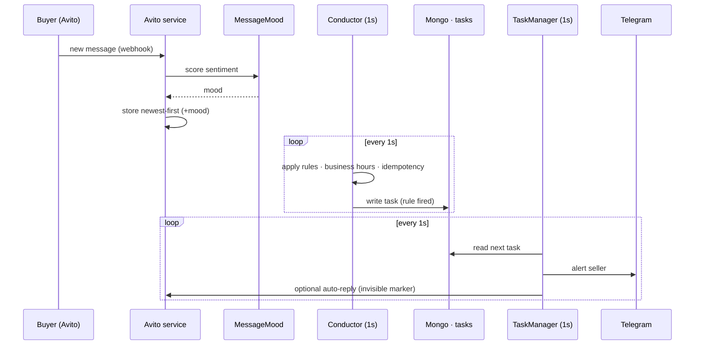

# The pipeline: source → detect → queue → deliver

The heart of MyAlert is a real-time event pipeline. A buyer's message enters as an Avito webhook, gets scored and stored, is evaluated against the seller's rules, becomes a task, and is delivered to Telegram and/or back into the Avito chat. Each stage is owned by a separate service.

## 1. Source: webhook ingest + sentiment

- **Webhook, not polling.** When a seller connects their Avito account, the Avito service registers a webhook (e.g. `/avito/messenger/.../webhook/<userId>`). New buyer messages are then pushed to MyAlert in real time. The **only** scheduled job in the system is a **5-minute OAuth token refresh** that keeps the Avito API credentials valid. Messages themselves are never polled.
- **Stored newest-first.** Incoming messages are written newest-first, so the detector can cheaply look at the head of a conversation to decide whether the latest message is still unanswered.
- **Sentiment at ingest.** At write time, the Avito service asks the Python **MessageMood** service to score the message. MessageMood uses **dostoevsky** with a **Russian fastText** social-network model and returns a mood label. Scoring once, at ingest, means the detector reads a precomputed value instead of invoking an NLP model in its hot loop.

## 2. Detect: the Conductor

The **Conductor** runs a **1-second loop**. On each tick it scans fresh conversations and evaluates the seller's enabled rules. There are four behaviours in play (three detection rules plus the business-hours gate):

| Rule | Fires when |
|---|---|
| **Lost message** | A buyer message is the most recent in the chat and no human has answered it. |
| **First message** | A brand-new conversation has just started (first contact). |
| **Negative mood** | The buyer's message was scored negative by MessageMood at ingest. |
| **Business-hours gate** | All of the above only fire inside the seller's configured working hours; outside them, detection is suppressed. |

**Idempotency marks.** Because the loop re-scans every second, each rule writes an **idempotency mark** once it fires for a given message/conversation. The mark guarantees a situation alerts **exactly once**. The next tick sees the mark and skips it, so the seller is not spammed with duplicate alerts for the same missed message.

When a rule fires, the Conductor does not deliver anything itself: it **writes a task** describing what to send and to whom.

## 3. Queue: the Mongo `tasks` collection

There is no broker. The Conductor inserts a document into the Mongo **`tasks`** collection; that collection *is* the queue. This cleanly decouples detection from delivery: the Conductor can keep detecting even if delivery is slow, and the delivery side can be restarted independently.

## 4. Deliver: the TaskManager

The **TaskManager** runs its own **1-second loop**, draining the `tasks` collection. For each task it performs one or both of:

- **Telegram alert:** through the Telegram bot service, the seller is pinged with the conversation that needs attention.
- **Avito auto-reply:** an automatic message is posted back into the Avito chat (for example, "Thanks for your message, we'll reply shortly"), buying the seller time.

### The invisible-character marker

An auto-reply is itself a message in the Avito chat, which creates a risk: the next Conductor tick could see the bot's own reply as "the latest message" and wrongly conclude the conversation has been answered (or, conversely, mis-handle who spoke last). MyAlert solves this by embedding a **zero-width Hangul Filler `ㅤ` (U+3164)** inside every auto-reply.

When the Avito service later ingests messages, any reply containing that invisible character is recognised as a **robot reply**. A robot reply therefore does **not** count as a real **human** answer, so it will not incorrectly suppress the "missed message" alert. The seller still gets pinged to actually respond. The character is invisible to the buyer, so the chat reads naturally.

---

See [`architecture.md`](architecture.md) for the services behind each stage and [`trade-offs.md`](trade-offs.md) for why the 1-second loops exist and what would replace them.
